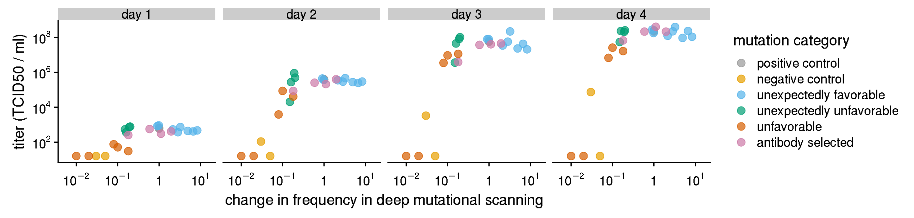
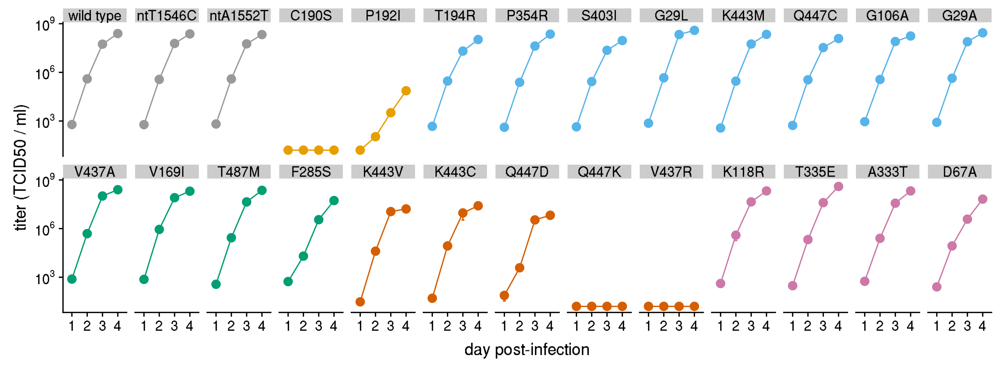
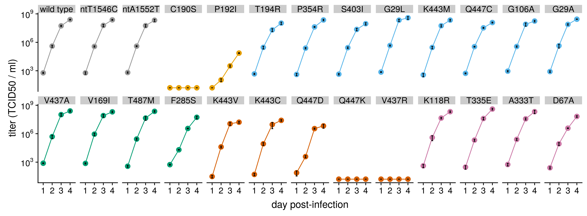
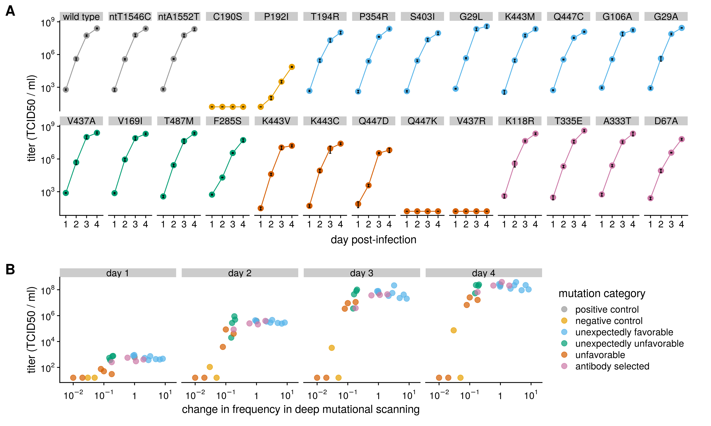

# Plot growth data
This R Jupyter notebook uses ggplot2 to plot the growth curve data.

Load R packages:


```R
options(warn=-1)

library("tidyverse")
library("cowplot")
library("IRdisplay")

sessionInfo()
```

    ── Attaching packages ─────────────────────────────────────── tidyverse 1.2.1 ──
    ✔ ggplot2 3.2.0     ✔ purrr   0.2.5
    ✔ tibble  1.4.2     ✔ dplyr   0.7.8
    ✔ tidyr   0.8.1     ✔ stringr 1.3.1
    ✔ readr   1.1.1     ✔ forcats 0.3.0
    ── Conflicts ────────────────────────────────────────── tidyverse_conflicts() ──
    ✖ dplyr::filter() masks stats::filter()
    ✖ dplyr::lag()    masks stats::lag()
    
    Attaching package: ‘cowplot’
    
    The following object is masked from ‘package:ggplot2’:
    
        ggsave
    


    R version 3.5.1 (2018-07-02)
    Platform: x86_64-conda_cos6-linux-gnu (64-bit)
    Running under: Ubuntu 14.04.5 LTS
    
    Matrix products: default
    BLAS/LAPACK: /fh/fast/bloom_j/software/conda/envs/BloomLab_v2/lib/R/lib/libRblas.so
    
    locale:
     [1] LC_CTYPE=en_US.UTF-8       LC_NUMERIC=C              
     [3] LC_TIME=en_US.UTF-8        LC_COLLATE=en_US.UTF-8    
     [5] LC_MONETARY=en_US.UTF-8    LC_MESSAGES=en_US.UTF-8   
     [7] LC_PAPER=en_US.UTF-8       LC_NAME=C                 
     [9] LC_ADDRESS=C               LC_TELEPHONE=C            
    [11] LC_MEASUREMENT=en_US.UTF-8 LC_IDENTIFICATION=C       
    
    attached base packages:
    [1] stats     graphics  grDevices utils     datasets  methods   base     
    
    other attached packages:
     [1] IRdisplay_0.7.0 cowplot_0.9.3   forcats_0.3.0   stringr_1.3.1  
     [5] dplyr_0.7.8     purrr_0.2.5     readr_1.1.1     tidyr_0.8.1    
     [9] tibble_1.4.2    ggplot2_3.2.0   tidyverse_1.2.1
    
    loaded via a namespace (and not attached):
     [1] pbdZMQ_0.3-3     tidyselect_0.2.4 repr_0.19.1.9000 haven_1.1.2     
     [5] lattice_0.20-35  colorspace_1.3-2 htmltools_0.3.6  base64enc_0.1-3 
     [9] rlang_0.3.0.1    pillar_1.3.0     glue_1.3.0       withr_2.1.2     
    [13] modelr_0.1.2     readxl_1.1.0     bindrcpp_0.2.2   uuid_0.1-2      
    [17] bindr_0.1.1      munsell_0.5.0    gtable_0.2.0     cellranger_1.1.0
    [21] rvest_0.3.2      evaluate_0.11    broom_0.5.0      Rcpp_1.0.0      
    [25] backports_1.1.2  scales_1.0.0     IRkernel_0.8.12  jsonlite_1.6    
    [29] hms_0.4.2        digest_0.6.18    stringi_1.2.4    grid_3.5.1      
    [33] cli_1.0.0        tools_3.5.1      magrittr_1.5     lazyeval_0.2.1  
    [37] crayon_1.3.4     pkgconfig_2.0.1  xml2_1.2.0       lubridate_1.7.4 
    [41] assertthat_0.2.0 httr_1.3.1       rstudioapi_0.7   R6_2.2.2        
    [45] nlme_3.1-137     compiler_3.5.1  


Color-blind palette:


```R
cbPalette <- c("#999999", "#E69F00", "#56B4E9", "#009E73",
               "#D55E00", "#CC79A7")
```

Plot axes labels in nice scientific notation:


```R
fancy_scientific <- function(x, parse.str=TRUE, digits=NULL) {
  # scientific notation formatting, based loosely on https://stackoverflow.com/a/24241954
  # if `parse.str` is TRUE, then we parse the string into an expression
  # `digits` indicates how many digits to include
  x %>% format(scientific=TRUE, digits=digits) %>% gsub("^0e\\+00","0", .) %>%
    gsub("^1e\\+00", "1", .) %>% gsub("^(.*)e", "'\\1'e", .) %>% 
    gsub("e\\+","e", .) %>% gsub("e", "%*%10^", .) %>%
    gsub("^\'1\'\\%\\*\\%", "", .) %>% {if (parse.str) parse(text=.) else .}
}
```

Function to save and show plots:


```R
figsdir <- "results/growth_data"
dir.create(figsdir, showWarnings=FALSE)

saveShowPlot <- function(p, width, height, plotname=NA) {
  if (is.na(plotname))
    plotname <- gsub("\\.", "_", deparse(substitute(p))) 
  pngfile <- file.path(figsdir, sprintf("%s.png", plotname))
  pdffile <- file.path(figsdir, sprintf("%s.pdf", plotname))
  ggsave(pngfile, plot=p, width=width, height=height, units="in")
  ggsave(pdffile, plot=p, width=width, height=height, units="in")
  display_png(file=pngfile, width=90 * width)
}
```

Read in the growth curve data, re-labeling the categories:


```R
data <- read.csv('data/all_growth_data.csv') %>%
  mutate(category=str_replace(category,
                              array('unexpectedly favorable'),
                              'tolerated but not seen in nature'),
         category=str_replace(category,
                              array('unexpectedly unfavorable'),
                              'other'),
         category=str_replace(category,
                              array('unfavorable'),
                              'other'),
         category=str_replace(category,
                              array('antibody selected'),
                              'other'),
         ) %>%
  transform(category=factor(category, c("positive control", "negative control",
                                        'tolerated but not seen in nature', 'other'))) %>%
  arrange(category, desc(DMS_foldchange), desc(mutation))

data
```


<table>
<thead><tr><th scope=col>mutation</th><th scope=col>category</th><th scope=col>DMS_foldchange</th><th scope=col>DMS_muteffect</th><th scope=col>transfection_IU</th><th scope=col>transfection_IU_SD</th><th scope=col>day_1</th><th scope=col>day_1_SD</th><th scope=col>day_2</th><th scope=col>day_2_SD</th><th scope=col>day_3</th><th scope=col>day_3_SD</th><th scope=col>day_4</th><th scope=col>day_4_SD</th></tr></thead>
<tbody>
	<tr><td>wild type                       </td><td>positive control                </td><td>1.00                            </td><td> 0.00000000                     </td><td> 7460000                        </td><td>1830000                         </td><td>605.3750                        </td><td> 88.827870                      </td><td>396250.000                      </td><td> 94795.79000                    </td><td>5.4800e+07                      </td><td>8.308817e+06                    </td><td>248000000                       </td><td>2.580000e+07                    </td></tr>
	<tr><td>ntT1546C                        </td><td>positive control                </td><td>1.00                            </td><td> 0.00000000                     </td><td> 8100000                        </td><td>1360000                         </td><td>598.2500                        </td><td>164.562200                      </td><td>367500.000                      </td><td> 53035.37000                    </td><td>6.0500e+07                      </td><td>1.690000e+07                    </td><td>235000000                       </td><td>2.730000e+07                    </td></tr>
	<tr><td>ntA1552T                        </td><td>positive control                </td><td>1.00                            </td><td> 0.00000000                     </td><td> 8870000                        </td><td>1380000                         </td><td>655.2500                        </td><td>102.412100                      </td><td>393500.000                      </td><td> 48813.42000                    </td><td>5.7300e+07                      </td><td>1.680000e+07                    </td><td>214000000                       </td><td>5.450000e+07                    </td></tr>
	<tr><td>C190S                           </td><td>negative control                </td><td>0.05                            </td><td>-2.96683280                     </td><td>   34500                        </td><td>  16100                         </td><td> 16.0000                        </td><td>  0.000000                      </td><td>    16.000                      </td><td>     0.00000                    </td><td>1.6000e+01                      </td><td>0.000000e+00                    </td><td>       16                       </td><td>0.000000e+00                    </td></tr>
	<tr><td>P192I                           </td><td>negative control                </td><td>0.03                            </td><td>-3.52104828                     </td><td>   74400                        </td><td>   7920                         </td><td> 16.0000                        </td><td>  0.000000                      </td><td>   108.075                      </td><td>    35.80864                    </td><td>3.2595e+03                      </td><td>8.394007e+02                    </td><td>    73400                       </td><td>7.011776e+03                    </td></tr>
	<tr><td>T194R                           </td><td>tolerated but not seen in nature</td><td>8.32                            </td><td> 2.11857878                     </td><td>10600000                        </td><td>1040000                         </td><td>469.5000                        </td><td> 70.588600                      </td><td>291850.000                      </td><td> 91236.08000                    </td><td>2.0500e+07                      </td><td>6.864600e+06                    </td><td>106000000                       </td><td>3.000000e+07                    </td></tr>
	<tr><td>P354R                           </td><td>tolerated but not seen in nature</td><td>6.65                            </td><td> 1.89533808                     </td><td> 6000000                        </td><td>1330000                         </td><td>410.7500                        </td><td>106.527300                      </td><td>243000.000                      </td><td> 39469.40000                    </td><td>4.2100e+07                      </td><td>4.316731e+06                    </td><td>228000000                       </td><td>4.070000e+07                    </td></tr>
	<tr><td>S403I                           </td><td>tolerated but not seen in nature</td><td>4.92                            </td><td> 1.59331241                     </td><td> 7450000                        </td><td>1800000                         </td><td>438.5000                        </td><td> 75.242390                      </td><td>272000.000                      </td><td> 51667.20000                    </td><td>2.3000e+07                      </td><td>6.453256e+06                    </td><td> 91900000                       </td><td>2.470000e+07                    </td></tr>
	<tr><td>G29L                            </td><td>tolerated but not seen in nature</td><td>3.24                            </td><td> 1.17585457                     </td><td>21600000                        </td><td>2400000                         </td><td>734.0000                        </td><td> 70.118940                      </td><td>460250.000                      </td><td> 60824.03000                    </td><td>2.1600e+08                      </td><td>5.780000e+07                    </td><td>388000000                       </td><td>1.270000e+08                    </td></tr>
	<tr><td>K443M                           </td><td>tolerated but not seen in nature</td><td>2.84                            </td><td> 1.04384792                     </td><td>18800000                        </td><td>1950000                         </td><td>370.2500                        </td><td>136.556700                      </td><td>288000.000                      </td><td> 81073.02000                    </td><td>5.6100e+07                      </td><td>1.500000e+07                    </td><td>220000000                       </td><td>4.700000e+07                    </td></tr>
	<tr><td>Q447C                           </td><td>tolerated but not seen in nature</td><td>2.14                            </td><td> 0.76168031                     </td><td>13600000                        </td><td>3650000                         </td><td>534.4000                        </td><td> 59.360420                      </td><td>348400.000                      </td><td> 35682.77000                    </td><td>3.3700e+07                      </td><td>4.073746e+06                    </td><td>122000000                       </td><td>1.400000e+07                    </td></tr>
	<tr><td>G106A                           </td><td>tolerated but not seen in nature</td><td>0.98                            </td><td>-0.02165745                     </td><td> 6000000                        </td><td>1920000                         </td><td>908.3333                        </td><td>144.024500                      </td><td>362833.300                      </td><td> 56914.80000                    </td><td>7.9800e+07                      </td><td>2.910000e+07                    </td><td>175000000                       </td><td>3.330000e+07                    </td></tr>
	<tr><td>G29A                            </td><td>tolerated but not seen in nature</td><td>0.91                            </td><td>-0.09288500                     </td><td>13300000                        </td><td>3970000                         </td><td>827.5000                        </td><td>159.775600                      </td><td>435500.000                      </td><td>191050.40000                    </td><td>7.7400e+07                      </td><td>1.350000e+07                    </td><td>275000000                       </td><td>1.410000e+07                    </td></tr>
	<tr><td>K118R                           </td><td>other                           </td><td>1.95                            </td><td> 0.67014918                     </td><td> 7380000                        </td><td> 744000                         </td><td>411.7500                        </td><td>151.779600                      </td><td>393250.000                      </td><td>212239.40000                    </td><td>4.4400e+07                      </td><td>8.151636e+06                    </td><td>210000000                       </td><td>3.840000e+07                    </td></tr>
	<tr><td>T335E                           </td><td>other                           </td><td>1.11                            </td><td> 0.10818587                     </td><td> 8850000                        </td><td>2730000                         </td><td>300.7000                        </td><td>120.318300                      </td><td>210500.000                      </td><td> 49500.00000                    </td><td>3.9800e+07                      </td><td>1.100000e+07                    </td><td>397000000                       </td><td>8.090000e+07                    </td></tr>
	<tr><td>A333T                           </td><td>other                           </td><td>0.59                            </td><td>-0.52469641                     </td><td> 3930000                        </td><td> 567000                         </td><td>561.0000                        </td><td>167.261300                      </td><td>250750.000                      </td><td> 54028.35000                    </td><td>3.6800e+07                      </td><td>8.859740e+06                    </td><td>211000000                       </td><td>8.030000e+07                    </td></tr>
	<tr><td>V437A                           </td><td>other                           </td><td>0.20                            </td><td>-1.60053020                     </td><td>11100000                        </td><td>5080000                         </td><td>770.5000                        </td><td> 61.375210                      </td><td>488250.000                      </td><td>187764.20000                    </td><td>1.0200e+08                      </td><td>3.220000e+07                    </td><td>250000000                       </td><td>5.540000e+07                    </td></tr>
	<tr><td>V169I                           </td><td>other                           </td><td>0.19                            </td><td>-1.63696795                     </td><td>14800000                        </td><td>2000000                         </td><td>739.0000                        </td><td>100.208100                      </td><td>889250.000                      </td><td>260096.60000                    </td><td>8.0400e+07                      </td><td>2.660000e+07                    </td><td>202000000                       </td><td>3.710000e+07                    </td></tr>
	<tr><td>K443V                           </td><td>other                           </td><td>0.18                            </td><td>-1.69701197                     </td><td> 5580000                        </td><td>2510000                         </td><td> 30.4650                        </td><td>  8.761881                      </td><td> 40500.000                      </td><td>  8908.32900                    </td><td>1.1200e+07                      </td><td>3.803581e+06                    </td><td> 16300000                       </td><td>3.583854e+06                    </td></tr>
	<tr><td>D67A                            </td><td>other                           </td><td>0.18                            </td><td>-1.69400477                     </td><td> 3820000                        </td><td> 686000                         </td><td>254.7000                        </td><td> 64.118040                      </td><td> 85225.000                      </td><td> 28197.29000                    </td><td>3.8150e+06                      </td><td>3.060637e+05                    </td><td> 65900000                       </td><td>1.290000e+07                    </td></tr>
	<tr><td>T487M                           </td><td>other                           </td><td>0.16                            </td><td>-1.80645507                     </td><td>11400000                        </td><td>1540000                         </td><td>368.2500                        </td><td> 83.320040                      </td><td>272250.000                      </td><td> 64090.27000                    </td><td>4.4300e+07                      </td><td>1.920000e+07                    </td><td>228000000                       </td><td>4.070000e+07                    </td></tr>
	<tr><td>F285S                           </td><td>other                           </td><td>0.15                            </td><td>-1.92915938                     </td><td> 3830000                        </td><td> 778000                         </td><td>541.2500                        </td><td> 57.760100                      </td><td> 20075.000                      </td><td>  1425.00000                    </td><td>3.5475e+06                      </td><td>2.916155e+05                    </td><td> 53600000                       </td><td>1.660000e+07                    </td></tr>
	<tr><td>K443C                           </td><td>other                           </td><td>0.10                            </td><td>-2.30754797                     </td><td> 5680000                        </td><td> 883000                         </td><td> 50.6000                        </td><td> 13.502650                      </td><td> 85425.000                      </td><td> 27866.54000                    </td><td>9.2125e+06                      </td><td>5.864039e+06                    </td><td> 25500000                       </td><td>4.913311e+06                    </td></tr>
	<tr><td>Q447D                           </td><td>other                           </td><td>0.08                            </td><td>-2.57637382                     </td><td>   19600                        </td><td>   5670                         </td><td> 75.6500                        </td><td> 41.483340                      </td><td>  3837.500                      </td><td>   950.45050                    </td><td>3.4325e+06                      </td><td>4.725000e+05                    </td><td>  6657500                       </td><td>2.895682e+06                    </td></tr>
	<tr><td>Q447K                           </td><td>other                           </td><td>0.02                            </td><td>-4.18718485                     </td><td>    8330                        </td><td>   3450                         </td><td> 16.0000                        </td><td>  0.000000                      </td><td>    16.000                      </td><td>     0.00000                    </td><td>1.6000e+01                      </td><td>0.000000e+00                    </td><td>       16                       </td><td>0.000000e+00                    </td></tr>
	<tr><td>V437R                           </td><td>other                           </td><td>0.01                            </td><td>-4.90959009                     </td><td>    5100                        </td><td>   6680                         </td><td> 16.0000                        </td><td>  0.000000                      </td><td>    16.000                      </td><td>     0.00000                    </td><td>1.6000e+01                      </td><td>0.000000e+00                    </td><td>       16                       </td><td>0.000000e+00                    </td></tr>
</tbody>
</table>


Tidy the data for plotting.
We are only going to plot the growth curve data and ignore the transfection titers:


```R
tidy_data <- data %>%
  gather(day, titer, day_1, day_2, day_3, day_4) %>%
  gather(day_sd, titer_SD, day_1_SD, day_2_SD, day_3_SD, day_4_SD) %>%
  mutate(day=day %>% str_replace('_', ' '),
         day_sd=day_sd %>% str_replace('_SD', '') %>% str_replace('_', ' ')) %>%
  filter(day == day_sd) %>%
  select(mutation, category, DMS_foldchange, day, titer, titer_SD) %>%
  mutate(day_num=day %>% str_replace('day ', '') %>% as.integer)

tidy_data %>% head
```


<table>
<thead><tr><th scope=col>mutation</th><th scope=col>category</th><th scope=col>DMS_foldchange</th><th scope=col>day</th><th scope=col>titer</th><th scope=col>titer_SD</th><th scope=col>day_num</th></tr></thead>
<tbody>
	<tr><td>wild type                       </td><td>positive control                </td><td>1.00                            </td><td>day 1                           </td><td>605.375                         </td><td> 88.82787                       </td><td>1                               </td></tr>
	<tr><td>ntT1546C                        </td><td>positive control                </td><td>1.00                            </td><td>day 1                           </td><td>598.250                         </td><td>164.56220                       </td><td>1                               </td></tr>
	<tr><td>ntA1552T                        </td><td>positive control                </td><td>1.00                            </td><td>day 1                           </td><td>655.250                         </td><td>102.41210                       </td><td>1                               </td></tr>
	<tr><td>C190S                           </td><td>negative control                </td><td>0.05                            </td><td>day 1                           </td><td> 16.000                         </td><td>  0.00000                       </td><td>1                               </td></tr>
	<tr><td>P192I                           </td><td>negative control                </td><td>0.03                            </td><td>day 1                           </td><td> 16.000                         </td><td>  0.00000                       </td><td>1                               </td></tr>
	<tr><td>T194R                           </td><td>tolerated but not seen in nature</td><td>8.32                            </td><td>day 1                           </td><td>469.500                         </td><td> 70.58860                       </td><td>1                               </td></tr>
</tbody>
</table>


Plot correlations among DMS fold-change and titers:


```R
dms_titer_corr <- tidy_data %>%
  ggplot(aes(DMS_foldchange, titer, color=category)) +
  geom_point(size=3, alpha=0.6) +
  facet_wrap(~ day, nrow=1) +
  scale_x_log10(name="change in frequency in deep mutational scanning",
                labels=fancy_scientific,
                expand=expand_scale(0.15, 0)) +
  scale_y_log10(name="titer (TCID50 / ml)",
                labels=fancy_scientific) +
  scale_color_manual(values=cbPalette[2:5],
                     name='mutation category') +
  theme(axis.text.x=element_text(vjust=0),
        strip.text.x=element_text(margin=margin(b=2)))

saveShowPlot(dms_titer_corr, 11.5, 2.75)
```





Plot titers for individual samples:


```R
dms_titer_vals <- tidy_data %>%
  transform(mutation=factor(mutation, tidy_data$mutation %>% unique)) %>%
  ggplot(aes(day_num, titer, color=category)) +
  geom_point(size=3) +
  geom_line() +
  geom_errorbar(aes(ymin=titer - titer_SD, ymax=titer + titer_SD), width=0.2) +
  facet_wrap(~ mutation, ncol=13) +
  scale_y_log10(name="titer (TCID50 / ml)",
                labels=fancy_scientific) +
  scale_x_continuous(name='day post-infection',
                     expand=expand_scale(0.15, 0)) +
  scale_color_manual(values=cbPalette[2:5], guide=FALSE) +
  theme(strip.text.x=element_text(margin=margin(b=2)))

saveShowPlot(dms_titer_vals, 11.5, 4.25)
```





With black error bars:


```R
dms_titer_vals_black_error <- dms_titer_vals + 
  geom_errorbar(aes(ymin=titer - titer_SD, ymax=titer + titer_SD), width=0.2, color='black')

saveShowPlot(dms_titer_vals_black_error, 11.5, 4.25)
```





Use cowplot to arrange into a single figure:


```R
merged_plot <- plot_grid(
    dms_titer_vals, dms_titer_corr,
    labels=c("A", "B"), label_size=18,
    ncol=1, rel_heights=c(4.25, 2.75), scale=0.95)

saveShowPlot(merged_plot, 12.5, 7.5)
```


Same figure with black error bars:


```R
merged_plot_black_error <- plot_grid(
    dms_titer_vals_black_error, dms_titer_corr,
    labels=c("A", "B"), label_size=18,
    ncol=1, rel_heights=c(4.25, 2.75), scale=0.95)

saveShowPlot(merged_plot_black_error, 12.5, 7.5)
```




